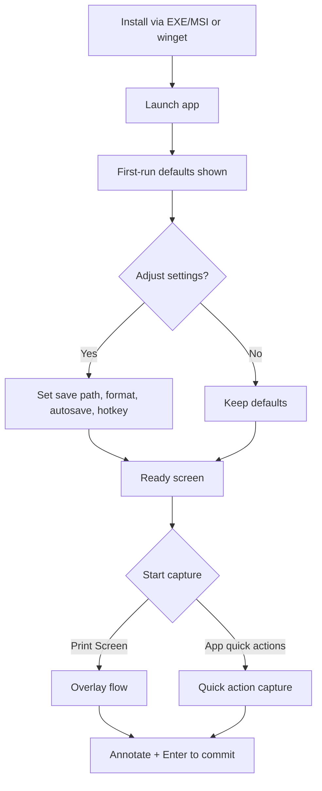

# UX Design Specification {{project_name}}

**Author:** {{user_name}}
**Date:** {{date}}

---

<!-- UX design content will be appended sequentially through collaborative workflow steps -->

## Executive Summary

### Project Vision

Deliver a Windows 11 port of Spectacle that matches the Linux experience with full feature parity for capture, recording, OCR, and annotation, while keeping the workflow fast, reliable, and offline-first.

### Target Users

Primary users are system admins/engineers who document technical procedures for others. They need clean, annotated captures without re-takes and value speed, predictability, and control.

### Key Design Challenges

- Pre-capture overlay annotation must be clear and low-friction while users adjust on-screen content before final capture.
- Global hotkey override (Print Screen) needs conflict handling without disrupting flow.
- Maintain parity with the Linux UX while adapting to Windows 11 expectations.
- Keep the UI fast and uncluttered while supporting capture, recording, and OCR in one tool.
- Support offline use and no telemetry while still offering a usable diagnostics path.

### Design Opportunities

- Make the pre-capture overlay a standout experience for first-try, annotated captures.
- Use sensible defaults and a clean first-run flow to reduce setup friction.
- Provide a consistent, muscle-memory-friendly workflow for users familiar with the Linux version.
- Create a seamless transition between capture, annotation, and save/record actions.

## Core User Experience

### Defining Experience

The core experience is capturing and documenting workflows with minimal friction: launch capture, select the area, annotate before capture, finalize, and save. The defining goal is Windows 11 parity with the Linux Spectacle workflow.

### Platform Strategy

- Windows 11 desktop application
- Mouse/keyboard primary
- Offline-first usage
- Multi-monitor support required
- DPI/scaling must be handled correctly across displays

### Effortless Interactions

- Print Screen ? capture overlay appears instantly
- Selection, annotation, and capture finalize without extra steps
- Save completes reliably without manual recovery
- Switching between monitors and DPI contexts feels seamless

### Critical Success Moments

- First capture + pre-annotation overlay behaves exactly like Linux
- User completes a full annotated screenshot without re-takes
- Recording and saving work predictably on first attempt
- Multi-monitor/DPI usage doesn't break the overlay or capture output

### Experience Principles

- Parity-first: match Linux behavior before adding new UX changes.
- Speed is trust: the overlay and capture must feel instant and dependable.
- Annotate before capture: preserve the unique pre-capture workflow.
- Zero surprises: saving and output must be stable and predictable.

## Desired Emotional Response

### Primary Emotional Goals

- Satisfaction that the process is working effortlessly.
- Confidence that captures and recordings are saved correctly.

### Emotional Journey Mapping

- **Discovery/first use:** Calm and reassured that this feels like Linux Spectacle.
- **Core flow:** Effortless, in-control, and uninterrupted.
- **After capture/record:** Confident and assured that the output is saved and correct.
- **When issues occur:** Recovery feels effortless and not stressful.

### Micro-Emotions

- Confidence
- Trust
- Control
- Satisfaction
- Calm

### Design Implications

- Make capture/record status and save completion unambiguous.
- Provide clear, low-friction recovery paths when conflicts occur.
- Reduce visual clutter in overlay and post-capture screens to reinforce calm control.
- Avoid surprise states that could create doubt about save success.

### Emotional Design Principles

- Effortless by default.
- Trust through clarity.
- Calm, not clever.
- Confidence after every capture.

## UX Pattern Analysis & Inspiration

### Inspiring Products Analysis

**SnipIT**
- Strengths: strong annotation toolkit and an effective capture overlay for region selection.
- Best UX qualities: clarity of tools during capture and immediate access to annotation capabilities.
- Weakness: feels heavy due to a separate editor window for annotation.

**Snipping Tool**
- Strengths: fast, efficient, minimal friction for quick captures.
- Best UX qualities: speed and simplicity.
- Weakness: too minimal; lacks robust annotation features.

### Transferable UX Patterns

**Interaction Patterns**
- Lightweight, in-overlay annotation during capture (from SnipIT) to reduce re-takes.
- Fast launch and immediate capture readiness (from Snipping Tool).

**Navigation & Flow**
- Keep capture and annotation in a single, continuous flow (avoid editor window hand-offs).
- Minimize steps between capture and save to preserve speed.

**Visual Patterns**
- Clear, focused overlay affordances that keep the user confident and in control.

### Anti-Patterns to Avoid

- Separate, heavy editor windows that break the capture flow (SnipIT).
- Over-simplified workflows that block meaningful annotations (Snipping Tool).

### Design Inspiration Strategy

**Adopt**
- Snipping Tool's speed and low-friction capture flow.
- SnipIT's rich annotation capability within the capture experience.

**Adapt**
- Embed annotation tools into the overlay and post-capture view to keep the workflow continuous.

**Avoid**
- Editor-window detours that slow the user down.
- A stripped-down UI that omits critical annotation needs.

## Design System Foundation

### 1.1 Design System Choice

Windows 11 native look and feel (Fluent Design conventions), optimized for desktop mouse/keyboard use.

### Rationale for Selection

- Aligns with user expectations on Windows 11 and builds immediate trust.
- Reduces cognitive friction for new Windows users while preserving Spectacle workflows.
- Supports the "effortless, reliable, no-surprises" emotional goals.

### Implementation Approach

- Use Windows 11 UI conventions for layout, spacing, typography, and control behavior.
- Map existing Spectacle flows to Windows-native affordances (menus, dialogs, overlays).
- Keep the capture/annotation overlay visually lightweight and system-consistent.

### Customization Strategy

- Minimal custom theming beyond what's needed for clarity and tool discoverability.
- Prioritize legibility, contrast, and consistent control states across monitors/DPI.
- Maintain a clean, utilitarian aesthetic over brand-heavy styling.

## 2. Core User Experience

### 2.1 Defining Experience

"Press Print Screen, select the region, optionally annotate before capture, finalize the capture, and optionally refine annotations after capture — with the clipboard updated on every annotation change."

### 2.2 User Mental Model

- Print Screen opens an immediate, lightweight overlay.
- The selection and annotation tools are obvious and fast to use.
- After capture, the user can keep refining the image without losing work.
- Clipboard is always current as annotations change.
- Saving is reliable and predictable.

### 2.3 Success Criteria

- The overlay appears instantly and behaves like Linux Spectacle.
- Region selection is precise, with optional annotations before capture.
- Each annotation update syncs to clipboard immediately.
- The capture completes cleanly and can be refined post-capture.
- The user feels confident the output is saved and correct.

### 2.4 Novel UX Patterns

- This uses established desktop capture patterns (Print Screen ? overlay ? capture) with a distinctive pre-capture annotation flow and live clipboard updates.

### 2.5 Experience Mechanics

**Initiation**
- User presses Print Screen.

**Interaction**
- User selects region.
- Optional: annotate on the overlay (free draw, arrows, boxes, circles).
- User finalizes capture.

**Feedback**
- Capture completion is visually confirmed.
- Clipboard updates on every annotation change (both pre- and post-capture).

**Completion**
- User can optionally annotate after capture.
- Output is ready for immediate paste from clipboard and saved reliably.

## Visual Design Foundation

### Color System

- Use Windows 11 Fluent system colors and neutrals.
- Accent color follows the system accent color to respect user OS preferences.
- Semantic colors (success/warning/error) use Fluent defaults for consistency.

### Typography System

- Primary typeface: Segoe UI Variable (system default).
- Clear hierarchy with standard Windows sizing for headings, labels, and body text.
- Prioritize legibility at typical desktop viewing distances.

### Spacing & Layout Foundation

- Standard density layout (not overly compact).
- 8px spacing grid for consistent alignment and rhythm.
- Clean, utilitarian layout with predictable grouping and alignment.

### Accessibility Considerations

- Rely on Fluent contrast standards and system color tokens.
- Support system text scaling and DPI scaling without layout breakage.
- Ensure focus states and selection states are clearly visible.


## Design Direction Decision

### Design Directions Explored

We explored the minimal overlay + quick tray direction and confirmed it best supports Spectacle's parity-first, fast-capture goals. This direction keeps chrome to a minimum and lets the overlay do the work, while still providing the essential controls for capture, annotation, and confirmation.

### Chosen Direction

**Direction E - Minimal Overlay + Quick Tray**

**Primary entry modes:**
1) **Print Screen overlay flow:** Screen darkens, a full-width/height crosshair tracks the mouse, and UI elements (dialogs, windows, menus) highlight on hover. Clicking a highlighted target sets the selection to that item's bounds. Users can annotate immediately or resize the selection with grab handles. Pressing Enter confirms the capture and commits to clipboard, disk autosave, or both (per user settings).

2) **App window flow:** Launching the app opens a simple window with a full-screen capture preview (all displays), plus quick actions: Display (select monitor), All displays, Active window, Rectangular region. Selecting any quick action takes the capture and enters annotation. Enter finalizes and commits to clipboard/disk per settings. Rectangular region uses the same overlay flow as #1.

Both entry modes use Direction E's minimal overlay + quick tray.

### Design Rationale

- **Speed and trust:** Minimal chrome reduces cognitive load and aligns with the "effortless, reliable" experience goals.
- **Parity-first:** Mirrors the Linux Spectacle mental model while adapting to Windows 11 expectations.
- **Low-friction annotation:** Immediate pre-capture annotation supports the "annotate before capture" principle without detours.
- **Two entry modes:** Hotkey flow serves power users; app window flow provides discoverable quick actions.

### Implementation Approach

- **Overlay behavior:** Darken screen, show full-width/height crosshair at cursor, highlight hoverable UI elements; click sets selection to target bounds.
- **Selection refinement:** Provide grab handles for resize/adjust; allow immediate annotation on selection.
- **Floating quick tray:** Toolbar prefers docking outside the selection (top/right/bottom/left). If selection is near-fullscreen, place the tray inside while avoiding the active annotation area; bias away from cursor and handles.
- **Finalize:** Enter confirms capture; commits to clipboard, autosave to disk, or both based on settings.
- **App window:** Full-screen capture preview with quick actions; "Display" highlights monitors on hover and selects a monitor on click; "All displays" captures all monitors; rectangular region routes to overlay flow.
- **System alignment:** Use Windows 11 Fluent visual language and system accent color; ensure multi-monitor/DPI behavior remains stable.

## User Journey Flows

### Journey 1: Perfect First-Try Capture With Pre-Annotation

Goal: capture a clean, annotated screenshot on the first try with minimal friction.

```mermaid
flowchart TD
A[Need a capture] --> B{Entry method}
B -->|Print Screen| C[Overlay appears]
B -->|Open app| D[App window with preview + quick actions]
D --> E{Quick action}
E -->|Display (select monitor)| F[Hover highlights monitors]
F --> G[Click monitor]
G --> H[Capture monitor and enter annotation]
E -->|All displays| I[Capture all displays and enter annotation]
E -->|Active window| J[Capture active window and enter annotation]
E -->|Rectangular region| C
C --> K[Crosshair tracks cursor; UI targets highlight on hover]
K --> L{Select target}
L -->|Click highlighted target| M[Selection bounds set]
L -->|Drag to draw| M
M --> N[Adjust with grab handles]
N --> O[Annotate in overlay]
O --> P{Need to reposition underlying UI?}
P -->|Yes| Q[Adjust UI while overlay stays active]
Q --> O
P -->|No| R[Press Enter to confirm]
R --> S[Commit to clipboard/disk per settings]
S --> T[Optional post-capture annotation]
T --> U[Save/share or start next capture]
H --> R
I --> R
J --> R
```

### Journey 2: Hotkey Conflict and Capture Troubleshooting

Goal: resolve hotkey issues, recover from delays, and provide diagnostics without blocking capture.

```mermaid
flowchart TD
A[Press Print Screen] --> B{Overlay appears?}
B -->|Yes| C[Proceed with capture flow]
B -->|No| D[Open app]
D --> E[Settings -> Hotkey]
E --> F[Remap hotkey]
F --> G[Test hotkey]
G --> H{Works?}
H -->|Yes| C
H -->|No| I[Use app quick actions as fallback]
I --> C
B -->|Delayed| J[Show "Initializing capture" + Cancel option]
J --> K{Wait or cancel?}
K -->|Wait| C
K -->|Cancel| D
C --> L{Overlay glitch or failure?}
L -->|Yes| M[Open diagnostics/bug report]
M --> N[Collect logs + context]
N --> O[Save or submit report]
L -->|No| P[Complete capture]
```

### Journey 3: Install and Set Sensible Defaults

Goal: get a user capturing quickly with minimal setup.



### Journey Patterns

- **Entry pattern:** Two entry points (Print Screen and app window) converge into the same overlay and annotation experience.
- **Selection pattern:** Hover highlight + click to select (UI targets, monitors) with resize handles for refinement.
- **Confirmation pattern:** Enter finalizes capture and commits to clipboard/disk per settings.
- **Recovery pattern:** If hotkey fails or overlay delays, provide immediate fallback to app quick actions and diagnostics.

### Flow Optimization Principles

- Minimize steps to first capture by keeping the overlay and quick actions lightweight.
- Keep annotation tools within a smart, floating tray that avoids the active drawing area.
- Use clear, immediate feedback (hover highlight, selection bounds, commit confirmation).
- Provide explicit escape hatches for delays or failures (cancel, retry, fallback, diagnostics).

## Component Strategy

### Design System Components

Use Windows 11 Fluent components for standard UI:
- Buttons, toggles, sliders, dropdowns, dialogs
- Text fields, tabs, tooltips, icons
- Command bars and menus

No toast/notification components are required for this project.

### Custom Components

### Capture Overlay
**Purpose:** Provide the pre-capture environment for selection and annotation.  
**Usage:** Full-screen overlay with dimming and hover highlighting.  
**Anatomy:** Dim layer, crosshair, hover target outline, selection bounds.  
**States:** Default, hover-highlight, selection-active, annotation-active.  
**Variants:** None.  
**Accessibility:** Keyboard confirm/cancel; focus-visible outlines for handles.  
**Interaction Behavior:** Tracks cursor; highlights UI targets; supports click-to-select.

### Selection Box + Grab Handles
**Purpose:** Define and refine capture bounds.  
**Usage:** Region selection in overlay or rectangular mode.  
**Anatomy:** Selection rectangle, corner/edge handles, size readout.  
**States:** Idle, resizing, moving, locked.  
**Variants:** None.  
**Accessibility:** Keyboard nudging; Enter confirms.  
**Interaction Behavior:** Drag handles or edges; snap to target bounds.

### Floating Quick Tray (Smart Dock)
**Purpose:** Minimal action strip for capture/annotation controls.  
**Usage:** Appears near selection; docks outside if space allows.  
**Anatomy:** Compact buttons + status indicators.  
**States:** Default, hover, active tool.  
**Variants:** Docked outside, docked inside (near-fullscreen selection).  
**Accessibility:** Keyboard navigation and clear focus states.  
**Interaction Behavior:** Prefers outside selection; if inside, avoids active annotation area and cursor path.

### Annotation Toolset (Reusable)
**Purpose:** Shared tool palette for pre- and post-capture annotation.  
**Usage:** Same component in overlay and post-capture canvas.  
**Anatomy:** Tool icons, color picker, stroke size control, undo/redo.  
**States:** Default, tool-selected, disabled.  
**Variants:** Compact (overlay), expanded (post-capture if needed).  
**Accessibility:** Keyboard shortcuts; tooltips and focus rings.  
**Interaction Behavior:** Live updates to canvas and clipboard.

### Monitor Highlight + Selection Overlay
**Purpose:** Enable display selection with hover feedback.  
**Usage:** App window "Display" action.  
**Anatomy:** Per-monitor highlight bounds, hover label.  
**States:** Idle, hover-highlight, selected.  
**Variants:** None.  
**Accessibility:** Keyboard cycling between monitors and confirm.  
**Interaction Behavior:** Hover to highlight, click to select.

### Post-Capture Canvas
**Purpose:** Display captured image for final annotation.  
**Usage:** After capture or for app-window quick actions.  
**Anatomy:** Canvas, zoom controls, annotation layer, save controls.  
**States:** Default, editing, saving.  
**Variants:** None.  
**Accessibility:** Keyboard tool access; zoom shortcuts.  
**Interaction Behavior:** Continues the same toolset as overlay.

### Component Implementation Strategy

- Use Fluent components for all standard UI to preserve Windows 11 parity.
- Build custom overlay/selection components on top of Fluent tokens for spacing, color, and typography.
- Reuse the annotation toolset across pre- and post-capture to keep workflows consistent.
- Favor lightweight, low-chrome UI for overlay components to preserve speed and focus.

### Implementation Roadmap

**Phase 1 - Core Capture Components**
- Capture Overlay
- Selection Box + Grab Handles
- Floating Quick Tray
- Annotation Toolset (reusable core)

**Phase 2 - App Window + Display Selection**
- Monitor Highlight + Selection Overlay
- Post-Capture Canvas

**Phase 3 - Enhancements**
- Expanded annotation variants (if needed for post-capture)
- Additional selection feedback (size/coordinate badge)

## UX Consistency Patterns

### Button Hierarchy

**When to Use:** Capture and confirmation actions across overlay and app window.  
**Visual Design:** Primary for "Capture" or "Confirm"; secondary for "Cancel" or "Back"; destructive only for discard.  
**Behavior:** Primary action is default on Enter; Escape cancels overlay.  
**Accessibility:** Clear focus rings; keyboard activation; high contrast states.  
**Variants:** Primary, secondary, destructive, icon-only.

### Feedback Patterns

**When to Use:** Capture readiness, selection state, annotation active state, save/clipboard commit state.  
**Visual Design:** Inline status text near quick tray or app window; subtle highlight and selection outlines.  
**Behavior:** No toast notifications. Use inline, persistent status while state is active; remove on completion.  
**Accessibility:** Status changes announce via screen reader; focus not stolen.  
**Variants:** Inline status label, overlay outline emphasis, progress indicator for delays.

### Form Patterns

**When to Use:** Settings (hotkeys, save path, format, autosave).  
**Visual Design:** Fluent fields with clear labels and helper text.  
**Behavior:** Validate on blur; show inline error text only.  
**Accessibility:** Keyboard navigation, proper labels, and error descriptions.  
**Variants:** Text fields, dropdowns, toggles.

### Navigation Patterns

**When to Use:** App window to capture modes; overlay to annotation and confirm.  
**Visual Design:** Simple quick action list in app window; overlay uses quick tray + keyboard shortcuts.  
**Behavior:** All entry paths converge to the same annotation flow; back/escape exits overlay cleanly.  
**Accessibility:** All actions reachable by keyboard; shortcuts documented in tooltips.

### Modal and Overlay Patterns

**When to Use:** Full-screen capture overlay, selection, and annotation.  
**Visual Design:** Dim background with high-contrast selection bounds; minimal chrome.  
**Behavior:** Overlay is topmost; Escape cancels; Enter confirms.  
**Accessibility:** Focus stays on overlay; clear focus states for handles and tools.

### Empty and Loading States

**When to Use:** First-run app window, delayed overlay start, diagnostics collection.  
**Visual Design:** Minimal text and icon; no distracting animations.  
**Behavior:** If overlay delay occurs, show "Initializing capture" with Cancel.  
**Accessibility:** Status announced; cancel reachable by keyboard.

### Annotation Interaction and Usage

**When to Use:** Pre- and post-capture annotation (shared toolset).  
**Visual Design:** Compact palette; active tool is visually distinct.  
**Behavior:**  
- Tool selection persists across sessions.  
- Undo/redo is always visible or accessible by shortcuts.  
- Annotation updates sync to clipboard in real time.  
**Accessibility:** Keyboard shortcuts for tools; tooltips for icons.

### Selection Handles and Resize Behavior

**When to Use:** Rectangular selection and target-bounds adjustment.  
**Visual Design:** Corner and edge handles with clear hit targets; hover highlight.  
**Behavior:**  
- Drag edges/corners to resize; drag inside to move.  
- Snap to highlighted target bounds on click.  
- Maintain minimum selection size; show size readout during resize.  
**Accessibility:** Arrow keys nudge selection; Shift for larger steps; Enter confirms.

## Responsive Design & Accessibility

### Responsive Strategy

- Desktop-first experience only (Windows 11). No mobile or tablet layouts.
- Support dynamic window resizing for the app window and settings panels.
- Overlay adapts to any monitor size and aspect ratio, including ultra-wide and mixed-resolution setups.
- Floating quick tray repositions based on available space and avoids the active annotation area.

### Breakpoint Strategy

- Use desktop-only layout tiers based on window width: compact, standard, wide.
- Compact: stack actions vertically and reduce spacing.
- Standard: default layout with full tool labels.
- Wide: allow side-by-side panels where useful (settings/preview).
- Overlay mode does not change layout by breakpoint; it scales to monitor bounds.

### Accessibility Strategy

- Target WCAG 2.1 AA compliance.
- Full keyboard operation: overlay, selection, annotation, confirm/cancel.
- Clear focus indicators and high-contrast selection bounds.
- Screen reader support via accessible labels and state announcements.
- Never rely on color alone to indicate selection or active tools.

### Testing Strategy

- Keyboard-only flows for capture, selection, annotation, confirm/cancel.
- Screen reader testing with NVDA.
- High-contrast mode verification for overlay and app window.
- Multi-monitor testing with mixed DPI and scaling (100% / 150% / 200%).
- Window resizing stress tests for compact and wide layouts.

### Implementation Guidelines

- Use per-monitor DPI awareness and scale all overlay elements (handles, icons, text).
- Maintain minimum hit target sizes for handles and tools.
- Keep focus trapped within the overlay while active; return focus to the app on exit.
- Announce key state changes (selection created, tool selected, capture confirmed).
- Use vector icons and Fluent tokens to stay crisp at all scales.
